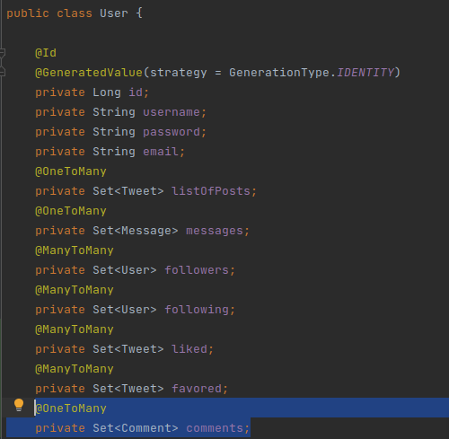
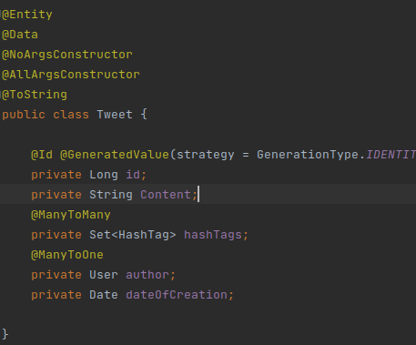
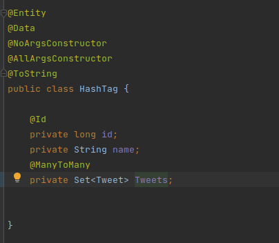
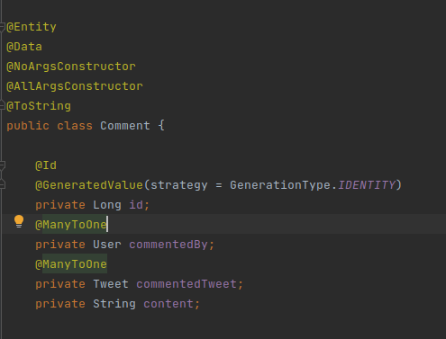

# Twitter

## Entites

### USER 

### TWEET

### MESSAGE

### HASHTAG

### Comment

## ROUTES

### Tweet Service 

- POST http://localhost:8080/tweet-service/tweet/post : to post a tweet 
- DELETE http://localhost:8080/tweet-service/tweet/delete/1 : to delete a tweet (idpost = 1)
- POST http://localhost:8080/tweet-service/tweet/comment : to comment a tweet
- GET http://localhost:8080/tweet-service/tweet/like/1 : to like a post (idpost = 1)
- GET http://localhost:8080/tweet-service/tweet/retweet/1 : to retweet a post (idpost=1)
- GET http://localhost:8080/tweet-service/tweet/favorite/1 : to add a post to favoris (idpost=1)

### Search Service 

- GET http://localhost:8080/search-service/search/user/{username} : to search a user
- GET http://localhost:8080/search-service/search/hashtag/{hashtag} : to search hashtag
- GET http://localhost:8080//search-service/search/tweet/{tweetContent} : to search tweet

### UserTimeline Service 

- GET http://localhost:8080/usertimeline-service/timeline/user/{id} : account profile

### hometimeline Service

- GET http://localhost:8080/usertimeline-service/timeline/home

### USER service 

- POST http://localhost:8080/user-service/user/signin 
- POST http://localhost:8080/user-service/user/signup 

